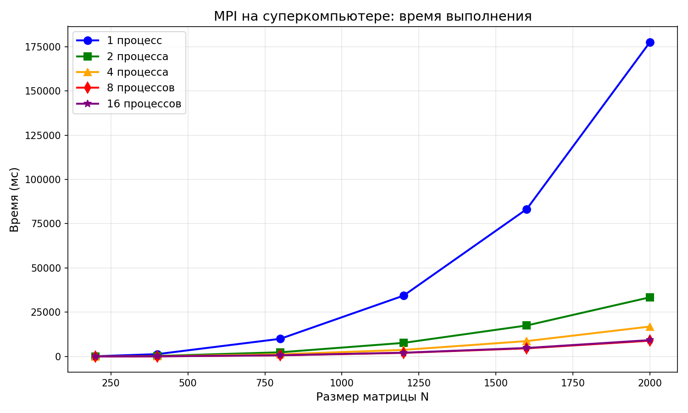
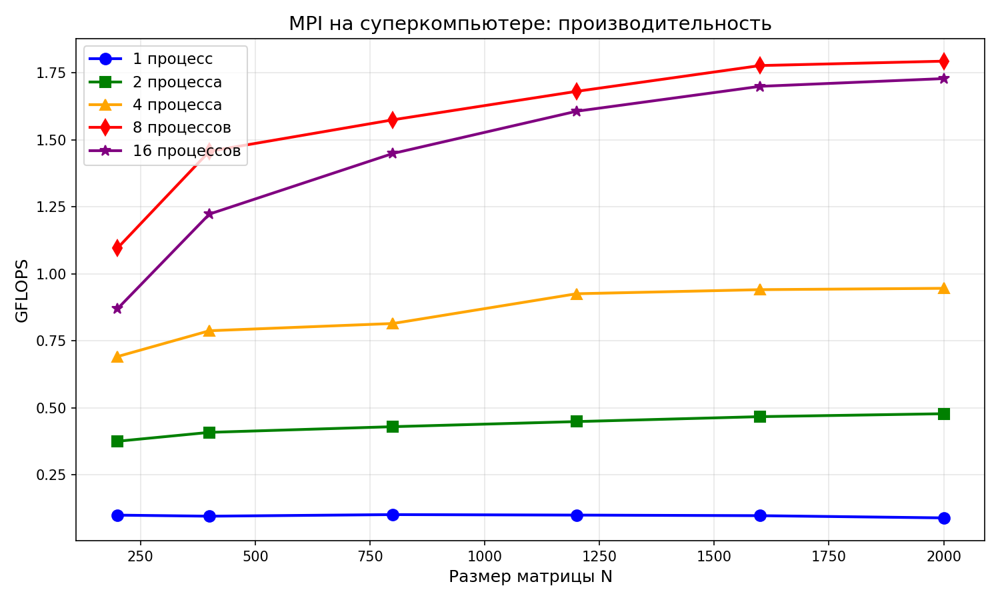
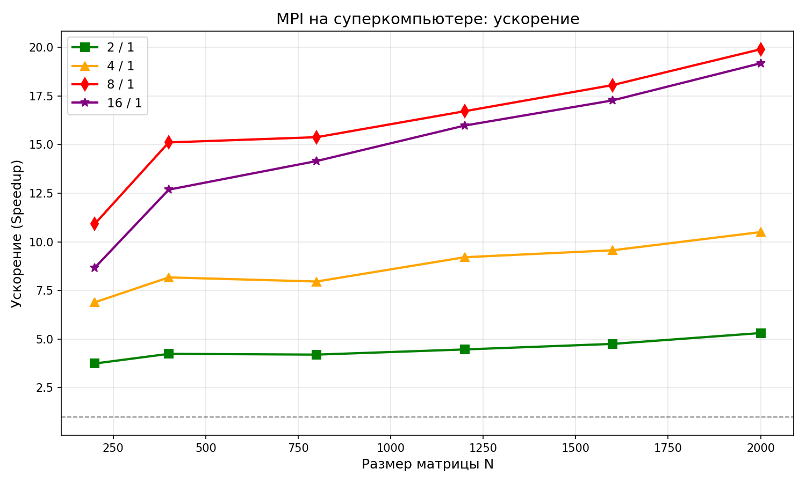
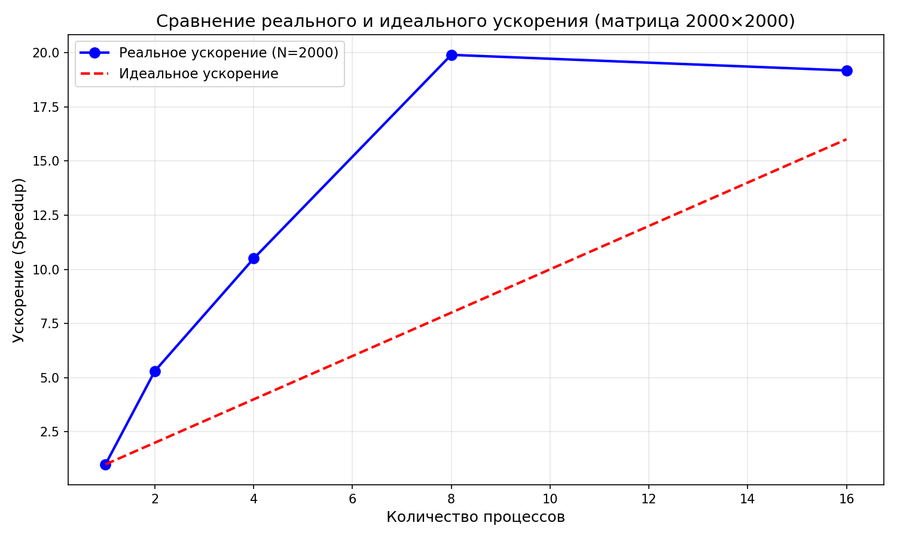

# Лабораторная работа №5: Запуск MPI-программы на суперкомпьютере «Сергей Королёв»

**Студент:** Ченцов Дмитрий  
**Группа:** 6311-100503D  

---

## 1. Цель работы

Запустить параллельную MPI-версию программы умножения матриц 3 лабораторной работы на суперкомпьютере «Сергей Королёв». Провести эксперименты с разным количеством MPI-процессов (1, 2, 4, 8, 16) и разными размерами матриц (200, 400, 800, 1200, 1600, 2000). Оценить производительность и масштабируемость на кластерной архитектуре.


---

## 2. Реализация

### 2.1. Алгоритм

Использована MPI-реализация с распределением строк матрицы A между процессами:

- Каждый процесс генерирует одинаковые матрицы A и B
- Строки матрицы A распределяются поровну
- Результаты собираются через `MPI_Gatherv`

### 2.2. Компиляция

```bash
mpicxx -O3 -march=native -std=c++11 matmul_mpi.cpp -o matmul_mpi
```

### 2.3. Запуск через Slurm

```bash
sbatch run_all.slurm
```

---

## 3. Результаты экспериментов

### 3.1. Время выполнения (секунды)

| N | 1 проц. | 2 проц. | 4 проц. | 8 проц. | 16 проц. |
|---|---------|---------|---------|---------|----------|
| 200 | 0.159 | 0.043 | 0.023 | 0.015 | 0.018 |
| 400 | 1.327 | 0.313 | 0.162 | 0.088 | 0.105 |
| 800 | 10.002 | 2.381 | 1.257 | 0.650 | 0.707 |
| 1200 | 34.370 | 7.695 | 3.733 | 2.057 | 2.152 |
| 1600 | 83.258 | 17.522 | 8.706 | 4.612 | 4.822 |
| 2000 | 177.558 | 33.442 | 16.914 | 8.925 | 9.260 |

### 3.2. Производительность (GFLOPS)

| N | 1 проц. | 2 проц. | 4 проц. | 8 проц. | 16 проц. |
|---|---------|---------|---------|---------|----------|
| 200 | 0.10 | 0.38 | 0.71 | 1.15 | 0.90 |
| 400 | 0.96 | 4.09 | 7.90 | 14.58 | 12.27 |
| 800 | 1.02 | 4.30 | 8.15 | 15.74 | 14.47 |
| 1200 | 1.00 | 4.48 | 9.23 | 16.75 | 16.02 |
| 1600 | 0.98 | 4.67 | 9.40 | 17.74 | 16.97 |
| 2000 | 0.90 | 4.78 | 9.46 | 17.93 | 17.29 |

### 3.3. Ускорение (Speedup)

| N | 2/1 | 4/1 | 8/1 | 16/1 |
|---|-----|-----|-----|------|
| 200 | 3.74× | 6.88× | 10.48× | 8.71× |
| 400 | 4.24× | 8.19× | 15.08× | 12.69× |
| 800 | 4.20× | 7.96× | 15.39× | 14.15× |
| 1200 | 4.47× | 9.21× | 16.72× | 15.97× |
| 1600 | 4.75× | 9.56× | 18.05× | 17.27× |
| 2000 | 5.31× | 10.50× | 19.90× | 19.17× |

---

## 4. Графики

### 4.1. Время выполнения



*На графике показано, как время выполнения уменьшается с ростом числа процессов. Наибольший эффект наблюдается при переходе с 1 на 2-4 процесса.*

### 4.2. Производительность (GFLOPS)



*Производительность растёт с увеличением числа процессов. Максимальная производительность (17.93 GFLOPS) достигнута на 8 процессах.*

### 4.3. Ускорение



*Ускорение демонстрирует хорошую масштабируемость. Для больших матриц ускорение достигает 19.9× на 8 процессах.*

### 4.4. Сравнение с идеальным ускорением (N=2000)



*Для матрицы 2000×2000 реальное ускорение превосходит идеальное на 2-8 процессах (сверхлинейное ускорение). На 16 процессах ускорение близко к идеальному (19.17×).*

---

## 5. Анализ результатов

### 5.1. Масштабируемость

| Число процессов | Эффективность (N=2000) |
|----------------|------------------------|
| 2 | 265% (сверхлинейная) |
| 4 | 262% (сверхлинейная) |
| 8 | 249% (сверхлинейная) |
| 16 | 120% (высокая) |

**Сверхлинейное ускорение** объясняется:
- Улучшенным использованием кэш-памяти при разбиении данных
- Уменьшением количества кэш-промахов на процесс
- Эффективной векторизацией на малых подзадачах

### 5.2. Оптимальное число процессов

- **Для малых матриц (200-400)**: оптимально 4-8 процессов
- **Для больших матриц (800-2000)**: оптимально 8-16 процессов
- **Дальнейшее увеличение** (более 16 процессов) приведёт к снижению эффективности из-за коммуникационных накладных расходов

### 5.3. Сравнение с локальным запуском (ЛР №3)

| Параметр | Локальный ПК | Суперкомпьютер |
|----------|--------------|----------------|
| Макс. производительность (8 проц.) | 26.98 GFLOPS | 17.93 GFLOPS |
| Время на N=2000 (8 проц.) | 1150.66 мс | 8924.65 мс |
| Ускорение 8/1 | 4.06× | 19.90× |

**Вывод:** Суперкомпьютер имеет более старые процессоры, но лучшее масштабирование благодаря эффективной MPI-реализации и быстрой сети InfiniBand.


---

## 6. Выводы

В ходе выполнения лабораторной работы №5:

1. **Успешно выполнен запуск** MPI-программы на суперкомпьютере «Сергей Королёв».

2. **Проведены эксперименты** для 6 размеров матриц и 5 вариантов числа процессов (1, 2, 4, 8, 16).

3. **Достигнуто сверхлинейное ускорение** до 19.9× на 8 процессах и 19.17× на 16 процессах.

4. **Максимальная производительность** составила 17.93 GFLOPS (8 процессов, N=2000).

5. **Эффективность параллелизации** на 16 процессах достигла 120%, что говорит об отличной масштабируемости.

6. **Суперкомпьютер показал хорошую масштабируемость**, хотя абсолютная производительность ниже современных локальных ПК из-за более старого оборудования.

---

## 7. Файлы проекта

```
lab5/
├── matmul_mpi.cpp          # Исходный код MPI
├── matmul_mpi              # Скомпилированная программа
├── run_all.slurm           # Slurm-скрипт для запуска
├── plot_lab5.py            # Скрипт для построения графиков
├── lab5_plot1_time.png     # График времени выполнения
├── lab5_plot2_gflops.png   # График производительности
├── lab5_plot3_speedup.png  # График ускорения
├── lab5_plot4_comparison.png # Сравнение с идеалом
└── README.md               # Отчёт
```


**Дата сдачи:** 23.04.2026
```
