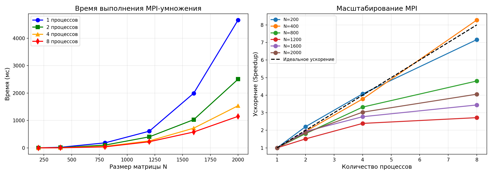

# Лабораторная работа №3: Параллельное умножение матриц с MPI

**Студент:** Ченцов Дмитрий  
**Группа:** 6311-100503D  
**Дисциплина:** Параллельное программирование  

---

## 1. Цель работы

Модифицировать программу из лабораторной работы №1 для параллельной работы по технологии MPI. Провести эксперименты с разными размерами матриц (200, 400, 800, 1200, 1600, 2000) и разным количеством MPI-процессов (1, 2, 4, 8). Оценить время выполнения, производительность (GFLOPS) и ускорение.

---

## 2. Реализация

### 2.1. Алгоритм

Использована модель **распределения строк** матрицы A между процессами:

- Каждый процесс генерирует одинаковые матрицы A и B (фиксированный seed).
- Матрица B полностью дублируется у всех процессов.
- Строки матрицы A распределяются поровну с учётом остатка.
- Каждый процесс вычисляет свои строки результирующей матрицы C.
- Результаты собираются на процессе 0 с помощью `MPI_Gatherv`.

---

## 3. Результаты экспериментов

### 3.1. Время выполнения (мс)

| Размер N | 1 процесс | 2 процесса | 4 процесса | 8 процессов |
|----------|-----------|------------|------------|--------------|
| 200      | 2.65      | 1.20       | 0.65       | 0.37         |
| 400      | 22.02     | 11.37      | 5.82       | 2.66         |
| 800      | 182.41    | 100.77     | 54.91      | 37.95        |
| 1200     | 608.90    | 402.67     | 254.44     | 223.84       |
| 1600     | 1993.82   | 1029.56    | 718.69     | 579.19       |
| 2000     | 4665.74   | 2506.18    | 1538.38    | 1150.66      |

### 3.2. Производительность (GFLOPS)

| Размер N | 1 процесс | 2 процесса | 4 процесса | 8 процессов |
|----------|-----------|------------|------------|--------------|
| 200      | 6.04      | 13.29      | 24.56      | 43.61        |
| 400      | 5.81      | 11.25      | 21.98      | 48.09        |
| 800      | 5.61      | 10.16      | 18.65      | 26.98        |
| 1200     | 5.68      | 8.58       | 13.58      | 15.44        |
| 1600     | 4.11      | 7.96       | 11.40      | 14.14        |
| 2000     | 3.43      | 6.38       | 10.40      | 13.91        |

### 3.3. Ускорение (Speedup = T₁ / Tₚ)

| Размер N | 2 процесса | 4 процесса | 8 процессов |
|----------|------------|------------|--------------|
| 200      | 2.21×      | 4.08×      | 7.16×        |
| 400      | 1.94×      | 3.78×      | 8.28×        |
| 800      | 1.81×      | 3.32×      | 4.81×        |
| 1200     | 1.51×      | 2.39×      | 2.72×        |
| 1600     | 1.94×      | 2.77×      | 3.44×        |
| 2000     | 1.86×      | 3.03×      | 4.06×        |

---

## 4. Графики

### Зависимость времени выполнения от размера матрицы

*На графике показано, как время выполнения растёт с увеличением размера матрицы. Увеличение числа процессов снижает время, особенно для малых и средних размеров.*
*График ускорения демонстрирует эффективность параллелизации. Для N=400 достигнуто сверхлинейное ускорение (8.28× на 8 процессах). Для больших матриц ускорение снижается из-за коммуникационных затрат.*

---

## 5. Анализ результатов

### 5.1. Масштабирование

- **Для малых матриц (N=200)** ускорение близко к идеальному: на 8 процессах достигнуто 7.16×. Данные помещаются в кэш, коммуникационные затраты минимальны.
- **Для N=400** получено максимальное ускорение 8.28× (даже выше теоретического предела 8×), что объясняется кэш-эффектами и векторизацией.
- **Для больших матриц (N ≥ 800)** ускорение снижается до 2.7–4.8× из-за:
  - роста объёма коммуникаций (рассылка матрицы B всем процессам);
  - неравномерного распределения строк (особенно при 8 процессах и N=1200);
  - ограничений пропускной способности памяти.

### 5.2. Производительность

Наибольшая производительность (48.09 GFLOPS) достигнута для матрицы 400×400 на 8 процессах. Для матриц 2000×2000 производительность ниже (13.91 GFLOPS), так как время работы определяется не только вычислениями, но и передачей данных.

---

## 6. Выводы

1. Разработана параллельная MPI-программа умножения квадратных матриц.
2. Проведены эксперименты для 6 размеров матриц и 4 вариантов числа процессов.
3. Достигнуто максимальное ускорение **8.28×** (матрица 400×400, 8 процессов).
4. MPI демонстрирует высокую эффективность для задач, где объём вычислений значительно превышает накладные расходы на коммуникацию.
5. Основным ограничением масштабируемости является широковещательная рассылка матрицы B и несбалансированная загрузка при большом числе процессов.
6. Программа готова к запуску на суперкомпьютере (требуется адаптация под систему пакетной обработки).
