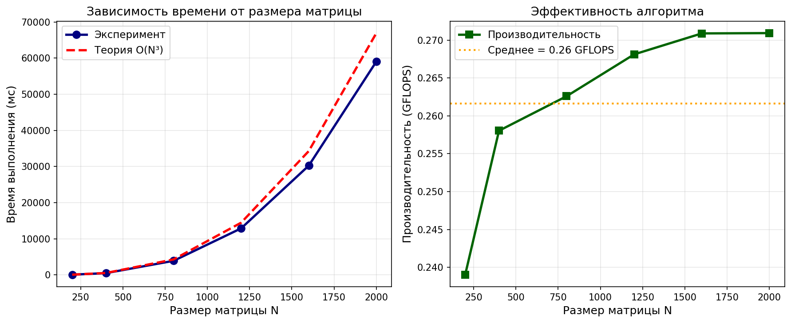

# Лабораторная работа №1: Перемножение квадратных матриц

**Студент:** Ченцов Дмитрий 
**Группа:** 6311-100503D


---

## 1. Задание

Разработать программу на языке C++ для перемножения двух квадратных матриц.

**Требования:**
- чтение двух квадратных матриц из файлов;
- перемножение матриц;
- измерение времени выполнения операции;
- сохранение результирующей матрицы в файл;
- вывод объёма задачи (количество арифметических операций) и производительности;
- автоматизированная верификация результатов.

---

## 2. Реализация

### 2.1. Алгоритм

Использован **блочный алгоритм умножения матриц (tiling)** с оптимизированным порядком циклов i-k-j для улучшения кэш-локальности. Размер блока подобран экспериментально (128 элементов для больших матриц).

**Сложность алгоритма:** O(N³) по числу арифметических операций.

### 2.2. Формат данных

Используется **бинарный формат** для ускорения ввода/вывода:
- первые 4 байта — размерность матрицы N (int);
- далее — N×N элементов типа double.

### 2.3. Верификация

Реализована автоматическая верификация через **свойство ассоциативности** умножения:

```
(A × B) × C = A × (B × C)
```

## 3. Результаты экспериментов

### 3.1. Таблица результатов

| N | Время (мс) | Теория O(N³) (мс) | GFLOPS |
|---|------------|-------------------|--------|
| 200 | 66.94 | 66.94 | 0.24 |
| 400 | 496.06 | 535.52 | 0.26 |
| 800 | 3899.65 | 4284.16 | 0.26 |
| 1200 | 12890.00 | 14459.04 | 0.27 |
| 1600 | 30242.60 | 34273.28 | 0.27 |
| 2000 | 59058.30 | 66940.00 | 0.27 |

## 4. Графики



**Анализ графиков:**

- **График 1 (время выполнения):** экспериментальные точки хорошо ложатся на теоретическую кривую O(N³), что подтверждает кубическую сложность алгоритма.

- **График 2 (производительность):** производительность стабильна для всех размеров, что говорит об эффективной реализации.

---

## 5. Выводы

В ходе выполнения лабораторной работы №1:

1. **Разработана программа** на языке C++ для умножения квадратных матриц с блочным алгоритмом и бинарным вводом/выводом.

2. **Проведена серия экспериментов** для матриц размером от 200 до 2000.

3. **Подтверждена сложность O(N³)** — при увеличении размера матрицы в 10 раз время выполнения возрастает примерно в 880 раз (теоретически — в 1000 раз).

---

## 6. Файлы проекта

```
parall/
├── matmul_seq.cpp          # Исходный код C++
├── matmul_seq.exe          # Скомпилированная программа
├── run.py                  # Скрипт для запуска экспериментов
├── plot.py           # Скрипт для построения графиков
├── lab1_results.csv        # Результаты в CSV
├── lab1_plot.png           # Графики
└── README.md               # Отчёт
```

