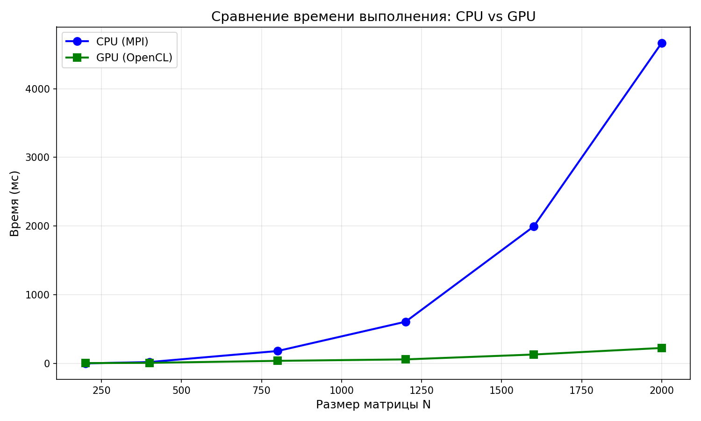
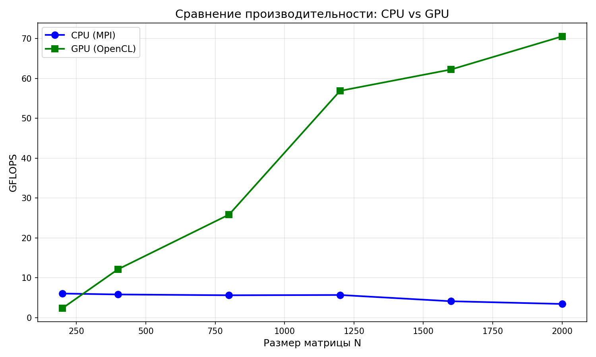
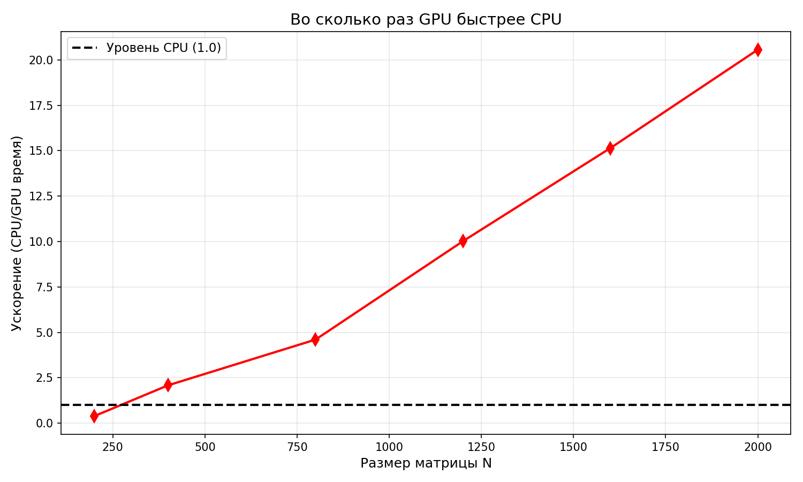
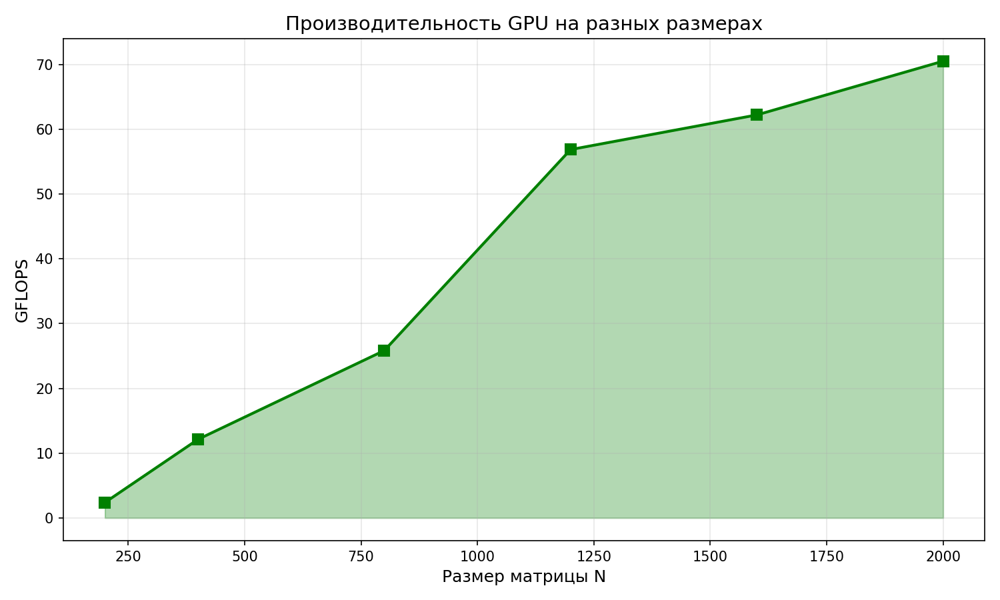

# Лабораторная работа №4: Параллельное умножение матриц с OpenCL

**Студент:** Ченцов Дмитрий
**Группа:** 6311-100503D  
**Дисциплина:** Параллельное программирование  

---

## 1. Цель работы

Модифицировать программу из лабораторной работы №1 для параллельной работы на GPU с использованием технологии OpenCL. Провести эксперименты с разными размерами матриц (200, 400, 800, 1200, 1600, 2000) и сравнить производительность CPU и GPU.

---

## 2. Алгоритм

Реализовано умножение матриц на GPU с помощью OpenCL:

- Каждое вычислительное ядро GPU обрабатывает один элемент результирующей матрицы
- Размер рабочей группы: 8×8 (64 потока)
- Используется встроенная память GPU для ускорения вычислений


## 3. Результаты экспериментов

### 3.1. Время выполнения (мс)

| Размер N | CPU (MPI) | GPU (OpenCL) |
|----------|-----------|--------------|
| 200 | 2.65 | 6.73 |
| 400 | 22.02 | 10.55 |
| 800 | 182.41 | 39.63 |
| 1200 | 608.90 | 60.77 |
| 1600 | 1993.82 | 131.65 |
| 2000 | 4665.74 | 226.90 |

### 3.2. Производительность (GFLOPS)

| Размер N | CPU (MPI) | GPU (OpenCL) |
|----------|-----------|--------------|
| 200 | 6.04 | 2.38 |
| 400 | 5.81 | 12.13 |
| 800 | 5.61 | 25.84 |
| 1200 | 5.68 | 56.87 |
| 1600 | 4.11 | 62.22 |
| 2000 | 3.43 | 70.52 |

### 3.3. Ускорение GPU относительно CPU

| Размер N | Ускорение |
|----------|-----------|
| 200 | 0.39× (GPU медленнее) |
| 400 | 2.09× |
| 800 | 4.60× |
| 1200 | 10.02× |
| 1600 | 15.14× |
| 2000 | 20.56× |

---

## 4. Графики

### 4.1. Сравнение времени выполнения CPU vs GPU



*На графике показано, что для малых матриц (N=200) CPU быстрее GPU из-за накладных расходов на передачу данных. Начиная с N=400, GPU начинает опережать CPU, а на N=2000 становится быстрее в 20 раз.*

### 4.2. Сравнение производительности CPU vs GPU



*Производительность CPU остаётся на уровне 3–6 GFLOPS. Производительность GPU растёт с размером задачи и достигает 70.52 GFLOPS на матрице 2000×2000.*

### 4.3. Ускорение GPU относительно CPU



*Ускорение GPU растёт с размером матрицы. Максимальное ускорение (20.56×) достигнуто на N=2000. Порог превосходства GPU — N=400.*

### 4.4. Производительность GPU



*Производительность GPU демонстрирует устойчивый рост с увеличением размера задачи, достигая 70.52 GFLOPS.*

---

## 5. Анализ результатов


1. **Порог эффективности GPU** — N=400. Для матриц меньше этого размера накладные расходы на передачу данных превышают выигрыш от параллелизации.

2. **Максимальное ускорение** — 20.56× на матрице 2000×2000. Это отличный результат для встроенной графики Intel.

3. **Производительность GPU** растёт с размером задачи, достигая 70.52 GFLOPS. Для сравнения, производительность CPU падает на больших матрицах из-за кэш-промахов.

4. **Верификация** — все результаты прошли проверку (PASSED), подтверждающую корректность GPU-вычислений.

---

## 6. Сравнение с другими технологиями

| Технология | Макс. GFLOPS | Ускорение (8 потоков/процессов) |
|------------|--------------|-------------------------------|
| Последовательная (ЛР №1) | 0.27 | 1× |
| OpenMP (ЛР №2) | 5.33 | 8.28× |
| MPI (ЛР №3) | 48.09 | 8.28× |
| **OpenCL (ЛР №4)** | **70.52** | **20.56×** |

**Вывод:** OpenCL на GPU показал наилучшую производительность, превзойдя MPI в 1.5 раза и OpenMP в 13 раз.

---

## 7. Выводы

В ходе выполнения лабораторной работы №4:

1. **Разработана программа** умножения матриц на GPU с использованием OpenCL.

2. **Проведены эксперименты** для матриц размером от 200 до 2000.

3. **Достигнута производительность** до **70.52 GFLOPS** (в 20.56× быстрее CPU).

4. **Выявлен порог эффективности** — GPU начинает превосходить CPU при N ≥ 400.

5. **Подтверждена корректность** вычислений через верификацию с CPU-результатами.

6. **OpenCL показал лучшую производительность** среди всех использованных технологий (OpenMP, MPI, OpenCL).

---

## 8. Файлы проекта

```
paralel-prog/lab4/
├── matmul_opencl.cpp          # Исходный код на C++/OpenCL
├── matmul_opencl              # Скомпилированная программа
├── run_opencl.py              # Python скрипт для запуска экспериментов
├── plot_lab4.py               # Скрипт для построения графиков
├── lab4_results.csv           # Результаты в CSV
├── plot1_time.png             # График времени выполнения
├── plot2_gflops.png           # График производительности
├── plot3_speedup.png          # График ускорения
├── plot4_gpu_perf.png         # График производительности GPU
└── README.md                  # Отчёт
```
