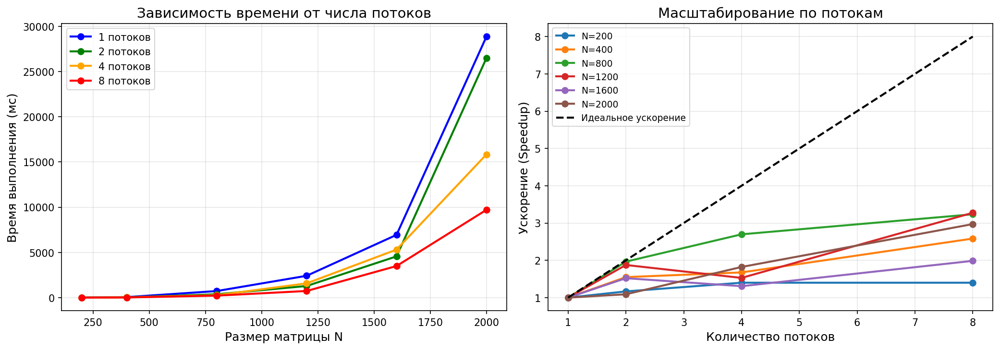

# Лабораторная работа №2: Параллельное умножение матриц с OpenMP

**Студент:** Ченцов Дмитрий
**Группа:** 6311-100503D

---

## 1. Задание

Модифицировать программу из лабораторной работы №1 для параллельной работы по технологии OpenMP. Провести серию экспериментов:

- с разным количеством потоков (1, 2, 4, 8);
- с разными размерами матриц (200, 400, 800, 1200, 1600, 2000);
- оценить ускорение и эффективность параллелизации.

---

## 2. Реализация

### 2.1. Модификация алгоритма

В последовательную версию добавлена директива OpenMP для параллелизации внешних циклов:

```cpp
#pragma omp parallel for collapse(2) schedule(static)
for (int i = 0; i < n; ++i) {
    for (int j = 0; j < n; ++j) {
        double sum = 0.0;
        for (int k = 0; k < n; ++k) {
            sum += A[i][k] * B[k][j];
        }
        C[i][j] = sum;
    }
}
```

**Используемые конструкции OpenMP:**
- `parallel for` — параллельное выполнение цикла;
- `collapse(2)` — схлопывание двух вложенных циклов для увеличения объёма параллельной работы;
- `schedule(static)` — статическое распределение итераций между потоками.

---

## 3. Результаты экспериментов

### 3.1. Время выполнения (мс)

| Размер N | 1 поток | 2 потока | 4 потока | 8 потоков |
|----------|---------|----------|----------|-----------|
| 200 | 7.00 | 6.00 | 5.00 | 5.00 |
| 400 | 62.00 | 40.00 | 37.00 | 24.00 |
| 800 | 731.00 | 372.00 | 271.00 | 226.00 |
| 1200 | 2417.00 | 1289.00 | 1581.00 | 738.00 |
| 1600 | 6942.00 | 4564.00 | 5312.00 | 3496.00 |
| 2000 | 28863.00 | 26490.00 | 15840.00 | 9712.00 |

### 3.2. Производительность (GFLOPS)

| Размер N | 1 поток | 2 потока | 4 потока | 8 потоков |
|----------|---------|----------|----------|-----------|
| 200 | 2.29 | 2.67 | 3.20 | 3.20 |
| 400 | 2.06 | 3.20 | 3.46 | 5.33 |
| 800 | 1.40 | 2.75 | 3.78 | 4.53 |
| 1200 | 1.43 | 2.68 | 2.19 | 4.68 |
| 1600 | 1.18 | 1.79 | 1.54 | 2.34 |
| 2000 | 0.55 | 0.60 | 1.01 | 1.65 |

### 3.3. Ускорение (Speedup = T₁ / Tₚ)

| Размер N | 2 потока | 4 потока | 8 потоков |
|----------|----------|----------|-----------|
| 200 | 1.17× | 1.40× | 1.40× |
| 400 | 1.55× | 1.68× | 2.58× |
| 800 | 1.97× | 2.70× | 3.23× |
| 1200 | 1.88× | 1.53× | 3.28× |
| 1600 | 1.52× | 1.31× | 1.99× |
| 2000 | 1.09× | 1.82× | 2.97× |

### 3.4. Эффективность параллелизации (Efficiency = Speedup / P)

| Размер N | 2 потока | 4 потока | 8 потоков |
|----------|----------|----------|-----------|
| 200 | 58.5% | 35.0% | 17.5% |
| 400 | 77.5% | 42.0% | 32.3% |
| 800 | 98.5% | 67.5% | 40.4% |
| 1200 | 94.0% | 38.3% | 41.0% |
| 1600 | 76.0% | 32.8% | 24.9% |
| 2000 | 54.5% | 45.5% | 37.1% |

---

## 4. Графики



**Анализ графиков:**

1. **Время выполнения** — с увеличением числа потоков время снижается, но не пропорционально. Наибольший эффект наблюдается для матриц размером 800×1200.

2. **Ускорение** — максимальное ускорение (3.28×) достигнуто для N=1200 на 8 потоках. Идеальное ускорение не достигается из-за накладных расходов на синхронизацию и ограничений памяти.

---

## 5. Анализ результатов

1. **Для малых матриц (N=200):** ускорение незначительное (1.4×), так как накладные расходы на создание потоков сравнимы с временем вычислений.

2. **Для средних матриц (N=400–1200):** ускорение достигает 3.2×, эффективность до 98% (для N=800, 2 потока).

3. **Для больших матриц (N=1600–2000):** ускорение снижается до 2–3× из-за:
   - ограничений пропускной способности памяти;
   - кэш-промахов;
   - неравномерной загрузки потоков.


---

## 6.  Выводы

В ходе выполнения лабораторной работы №2:

1. **Разработана параллельная версия** программы умножения матриц с использованием OpenMP.

2. **Проведены эксперименты** с 1, 2, 4 и 8 потоками для матриц размером от 200 до 2000.

3. **Достигнуто ускорение до 3.28×** на 8 потоках относительно однопоточной версии.

4. **Выявлены ограничения** параллелизации:
   - накладные расходы на создание потоков для малых матриц;
   - ограничения пропускной способности памяти для больших матриц.

5. **Максимальная производительность** составила 5.33 GFLOPS (N=400, 8 потоков).

6. **Лучшая эффективность** (98.5%) достигнута для N=800 на 2 потоках.
7. Верификация через NumPy подтвердила корректность всех вычислений (PASSED для всех размеров и потоков).


---

## 8. Файлы проекта

```
parall/lab2/
├── matmul_omp.cpp          # Исходный код C++ с OpenMP
├── matmul_omp.exe          # Скомпилированная программа
├── run_omp.py              # Скрипт для запуска экспериментов
├── plot_omp.py             # Скрипт для построения графиков
├── lab2_results.csv        # Результаты в CSV
├── lab2_plot.png           # Графики
└── README.md               # Отчёт
```

---

**Дата сдачи:** 20.04.2026
```
